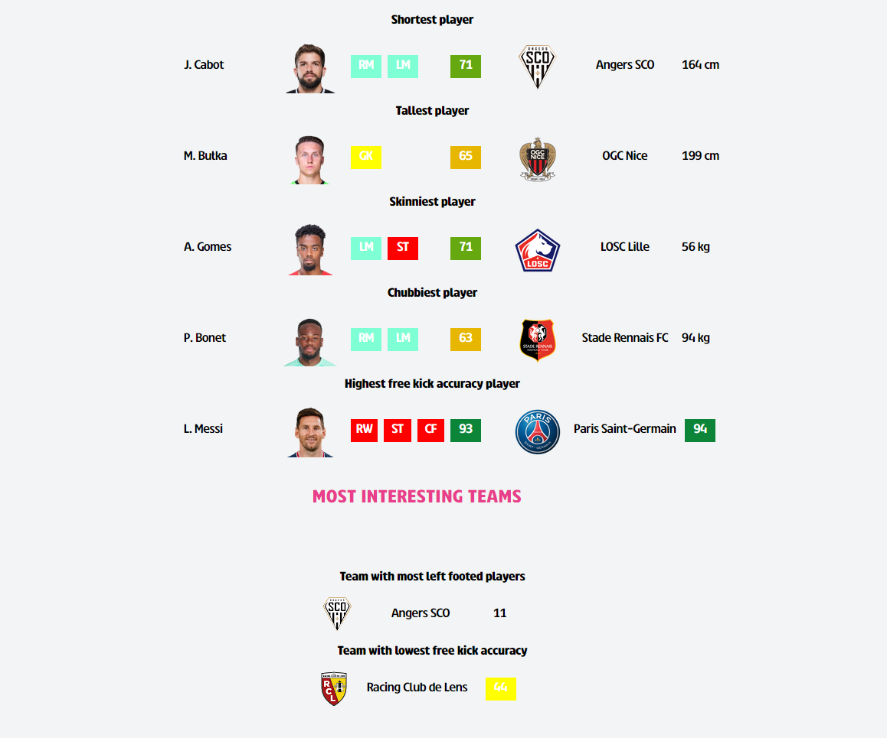
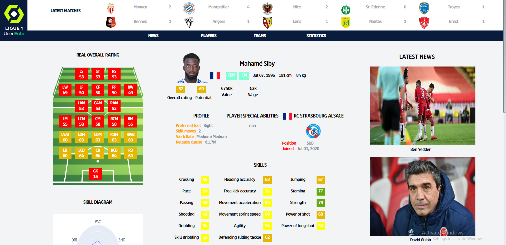
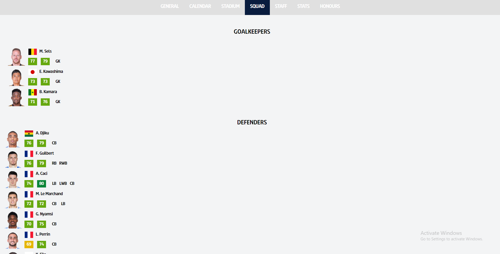
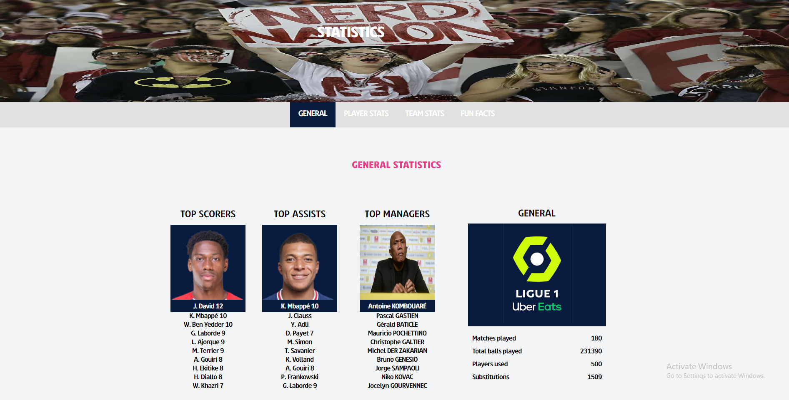
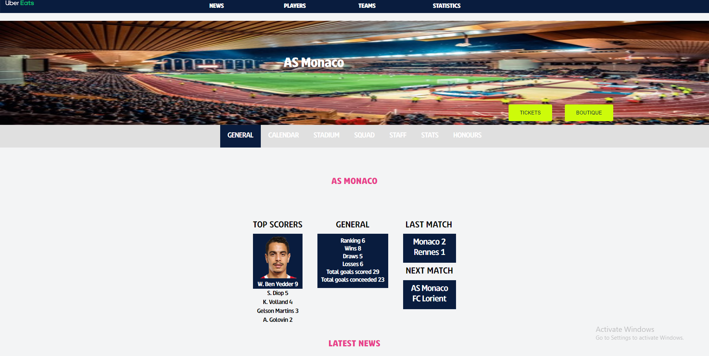

This project is a website for French Ligue 1.

You can check all results, statistics, players, players detailed stats and preferred positions, teams detailed stats (squad, staff, results, schedules etc.), best managers etc.

It uses:
<ul>
<li>Mongo DB</li>
<li>Selenium automation testing tool</li>
<li>Unit testing</li>
<li>Object relational mapping</li>
<li>Datasets and matplotting charts</li>
<li>Fifa player dataset to make players tab with each player statistics (players tab, player name)</li>
</ul>